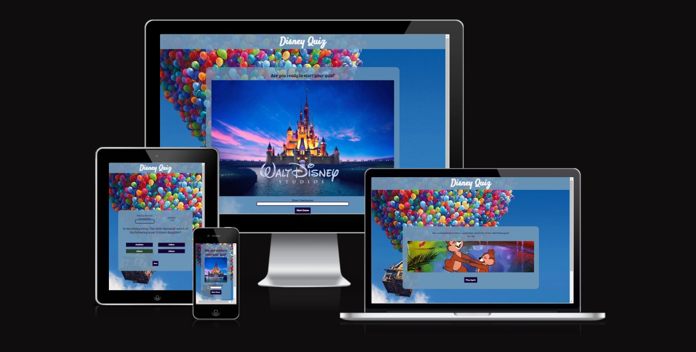
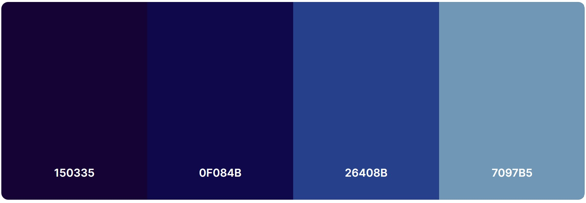
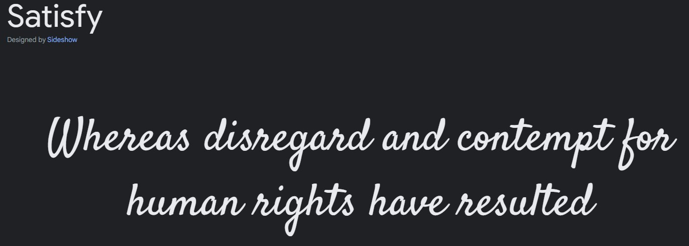
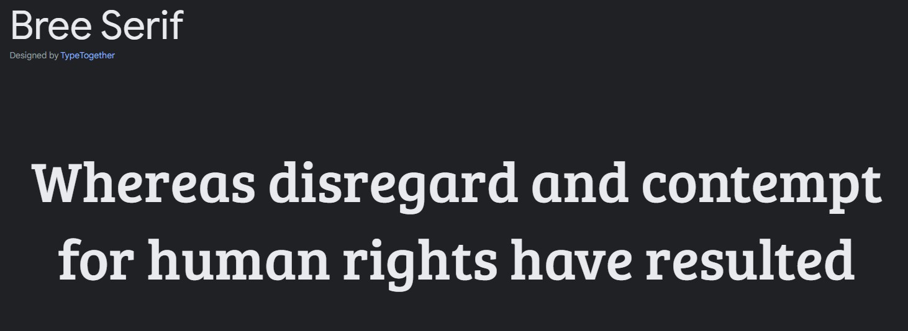
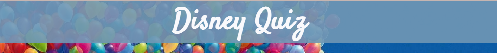

# Disney Quiz - Portfolio Project 2
This is a multiple-choice quiz website. It is a quiz game containing questions from different Disney movies. It has timed conditions to make the quiz more challenging and then displays your overall score at the end.

The aim of the project is to build a responsive website/game using HTML, CSS and JavaScript.
The website is responsive on mobile phones, tablet and desktop. 

[Live Link to the site](https://fatimaqais.github.io/disney-quiz/)

## __User Experience (UX) and Design__
### __User Stories__

- As a user, I'd like to see an image that clearly shows what the quiz is going to be about.
- As a user, I would like to enter a username and start the quiz.
- As a user, I would like to see which question I am on and how much time I have to answer it.
- As a user, I would like to see the questions and the options I get with it.
- As a user, I would like to see if the answer I have chosen is right or wrong before moving on to the next question.
- As a user, I would like to see my final score and an option to play again.

### __Color Scheme__
- The color scheme for this page was taken from [coolors](https://coolors.co/palette/fffaf5-95a78d-3a4336-d88f81).
Some colours were adjusted accordingly to improve visibility.

### __Typography__
- The font for this page was taken from [google fonts](https://fonts.google.com/)
    - The font Satisfy was used for the header.
    - The font 'Bree Serif" was used for the body.

### __Wireframes__
- To check out the wireframes for this project, [click here](/WIREFRAMES.md).

## __Features__
### __Common Features__
These features are seen throughout the whole quiz game:

- __Header__
- This is present on every page and shows the name of the quiz game to the user. The header is in a cursive font so it is similar to the original Disney logo. The text is on blue background colour to increase visibility for the user.

- __Footer__
- The footer is seen throughout the quiz so the user can click on the icon and access the link whenever they like. The footer links open in a new tab. It contains a GitHub link and a LinkedIn link.

