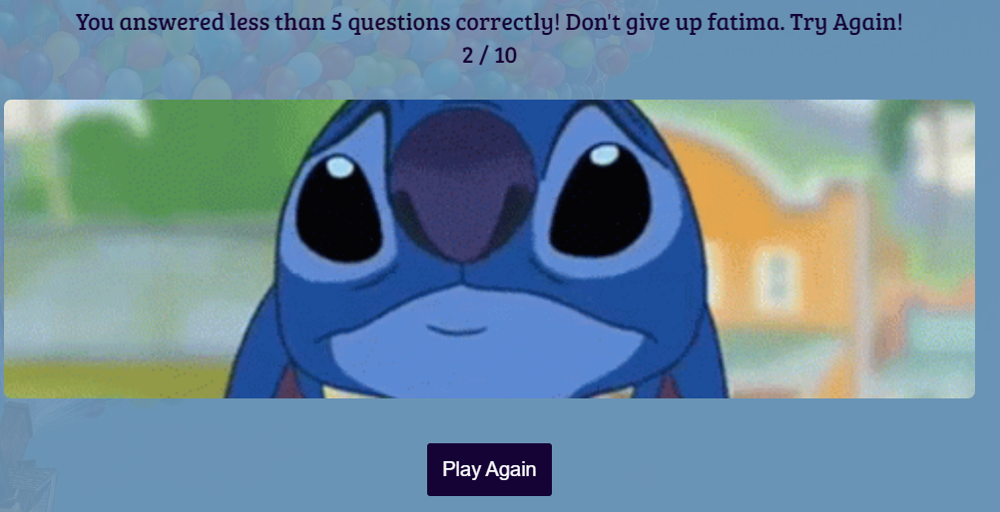

# Disney Quiz - Portfolio Project 2
This is a multiple-choice quiz website. It is a quiz game containing questions from different Disney movies. It has timed conditions to make the quiz more challenging and then displays your overall score at the end.

The aim of the project is to build a responsive website/game using HTML, CSS and JavaScript.
The website is responsive on mobile phones, tablet and desktop. 

[Live Link to the site](https://fatimaqais.github.io/disney-quiz/)

## __User Experience (UX) and Design__
### __User Stories__

- As a user, I'd like to see an image that clearly shows what the quiz is going to be about.
- As a user, I would like to enter a username and start the quiz.
- As a user, I would like to see which question I am on and how much time I have to answer it.
- As a user, I would like to see the questions and the options I get with it.
- As a user, I would like to see if the answer I have chosen is right or wrong before moving on to the next question.
- As a user, I would like to see my final score and an option to play again.

### __Color Scheme__
- The color scheme for this page was taken from [coolors](https://coolors.co/palette/fffaf5-95a78d-3a4336-d88f81).
Some colours were adjusted accordingly to improve visibility.

### __Typography__
- The font for this page was taken from [google fonts](https://fonts.google.com/)
    - The font Satisfy was used for the header.
    - The font 'Bree Serif" was used for the body.

### __Wireframes__
- To check out the wireframes for this project, [click here](/WIREFRAMES.md).

## __Features__
### __Common Features__
These features are seen throughout the whole quiz game:

- __Header__
- This is present on every page and shows the name of the quiz game to the user. The header is in a cursive font so it is similar to the original Disney logo. The text is on blue background colour to increase visibility for the user.

- __Footer__
- The footer is seen throughout the quiz so the user can click on the icon and access the link whenever they like. The footer links open in a new tab. It contains a GitHub link and a LinkedIn link.

- __Title Icon__
- The title shows the quiz name and it has an icon of a castle next to it.

### Start Page
When the user clicks on the link for the site, this is the first thing they'll see. The background image is colourful to try and match the theme of Disney movies which is usually happy. The background image is from the Disney movie 'Up'. The start page container has an image of Walt Disney studios and then an input username box for the user to enter before starting the quiz. The username is verified and then allows the user to press the start quiz button to start the game.

- __Username Input Box and Start Button__
- This checks the user has entered enough characters to start the game. It also doesn't allow the user to leave an empty field before starting the game.

- The start button only starts the quiz once the username meets the criteria.

### Quiz Page
When the user has started the quiz, they'll see a timer with the question number and the question with its answer option. They'll see the next button once they have selected an answer or when the time is up.

- __Timer__
- The timer displays the time in number as well as a meter that goes down with the time left.

- __Question Number__
- The question number is displayed in the top corner to show the user what question number they're on.

- __Question and Answer Options__
- The question is displayed on the quiz which is fetched from the question.js file. It displays 4 options from which only one answer is correct. If the user's answer is correct, the selected option changes to green but if it is wrong it changes to red.
- Once an answer is selected the next button is displayed. Or if the time is up the next button is displayed.

### Score Page
Once 10 questions are answered by the user, the score page is displayed. If the user has answered more than 5 questions correctly, a congratulations message is displayed with a happy gif. If the user gets less than 5 questions right a try again message is displayed with a sad gif.

- Gif displayed when less than 5 questions are answered correctly.

- Play Again button takes the user back to the start page.

### Features Left to Implement
- I would like to add different difficulties for users where they can answer more than 10 questions if a higher difficulty level is selected.
- I would also like to add different categories in the future where people can choose to play quizzes related to the movie/show they like.

## __Technologies Used__

### Languages Used

- HTML5
- CSS3
- JavaScript

### Frameworks, Libraries & Programs Used

- [Balsamiq](https://balsamiq.com/) was used to create the wireframes for this project.
- [Git](https://git-scm.com/) was used for version control.
- [Github](https://github.com/) was used to save and store the project's code.
- [Google Fonts](https://fonts.google.com/) was used to import the fonts used on the website.
- [Font Awesome](https://fontawesome.com/) was used for the icons on this page.
- [Flaticon](https://www.flaticon.com/) was used to find the icon for the title.
- [Am I Responsive](https://ui.dev/amiresponsive) was used to get the Mockup screenshot.

## __Testing__
### User Testing
- After deploying the site, the quiz was played by family and friends to test if it is user freindly.
- The quiz was tested on different devices such as laptop, tablet and mobile phones. The site works well on different devices and is responsive to different screen sizes.
- The site was tested on different browsers like Chrome, Edge and Firefox. The site had no issues across all browsers. 
- The username input box displays a very clear message if the username entered is not in the correct format.
- The footer links work fine and open on a new page/tab.
- The quiz works perfectly and is responsive on Safari as well.

### Validator Testing
- HTML
    - No errors were found when passing the index.html page through the [W3C validator](https://validator.w3.org/nu/?showsource=yes&doc=https%3A%2F%2Ffatimaqais.github.io%2Fdisney-quiz%2F).

- CSS 
    - No errors were found when passing the code from the stylesheet through the official Jigsaw validator.

- JavaScript
    - No errors were found when passing the script.js file through the official [JSHint validator](https://jshint.com/)
    - When validating the script.js file, it shows that there is one undefined variable "quizQuestions". This variable has been defined in the question.js file and is being called internally from the HTML file.

    - No errors were found when passing the question.js file through the official [JSHint validator](https://jshint.com/)
    - When validating the question.js file, it shows that the variable "quizQuestions" is an unused variable but it is being used in the script.js file.

### Performance and Accessibility Testing
The site was tested for performance and accessibilty using Lighthouse on google chrome's developer tools.

- Lighthouse testing for Desktop

- Lighthouse testing for Mobile

## __Deployement__

This website was deployed to GitHub Pages. The steps to deploy are:
- Log in to GitHub
- Go to the setting for this repository.
- Select pages in the left-hand navigation menu.
- From the source dropdown, select the main branch and then press save.
- The site will be deployed now. It may take a few minutes to go live.

### Local Deployment
To fork this repository, follow these steps:
- Log in to GitHub
- Go to the repository, https://github.com/fatimaqais/disney-quiz
- On the top right corner, click on the button that says fork.

To clone this repository, copy the command below and paste it into your terminal:

- `https://github.com/fatimaqais/disney-quiz.git`

## __Credits__

### Code
- The username validation code was taken from this [youtube video](https://www.youtube.com/watch?v=1iw5sdQAxAY).
- The code idea for the timer was taken from this [page](https://www.codeexplained.dev/2018/10/create-multiple-choice-quiz-using-javascript.html?m=1).
- The code idea to display questions from an array was taken from this [youtube video](https://www.youtube.com/watch?v=riDzcEQbX6k&t=1353s).
### Content
- Some of the questions for the quiz were taken from [we love quizzes site](https://www.welovequizzes.com/disney-quiz-questions-and-answers/).
### Media
- The title icon was taken from [flaticon](https://www.flaticon.com/)
- The icons for about section were taken from [Font Awesome](https://fontawesome.com/)
- The gifs on the score page, start page image and background image was found on google images.
    - The link for the sad gif image is: [sad gif link](https://www.icegif.com/wp-content/uploads/2021/11/icegif-1425.gif)
    - The link for the happy gif is: [happy gif link](https://66.media.tumblr.com/29094bb92f953c1c507e56b35916ea29/c87ade020a2a9001-c8/s500x750/2c716b09022bc03a59da6b1cb85a923aea3d4cbe.gif)
    - The backgoruound image is form the movie UP and is taken from this [link](https://wallpaperaccess.com/full/1706846.jpg)
    - The start page image was taken from this [link](https://www.denofgeek.com/wp-content/uploads/2017/12/walt-disney-studios.jpg?fit=1920%2C1080)