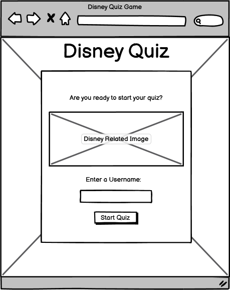
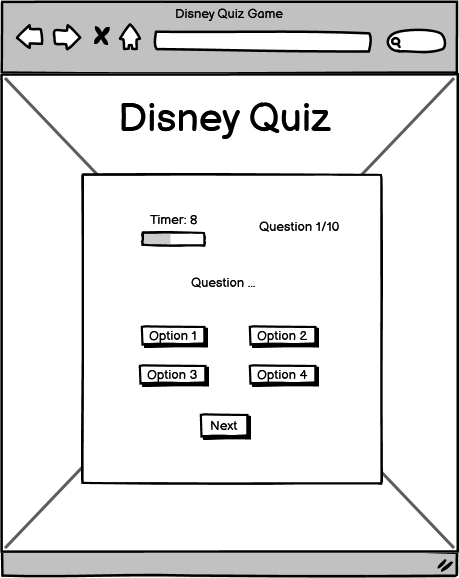
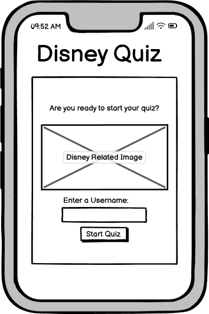
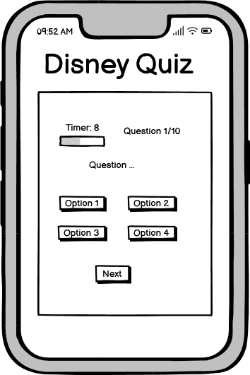
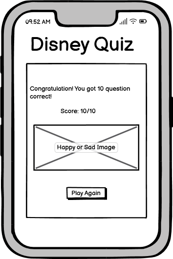

## __Wireframes__
The wireframes for this website were created using Balsamiq. I planned the desktop layout and the mobile layout for the quiz.
I kept the mobile layout and desktop layout similar for a consistent design.

- __Desktop Wireframes__

- Start Page

- Quiz Page

- Final Score Page

- __Mobile Wireframes__

- Start Page

- Quiz Page

-Final Score Page

